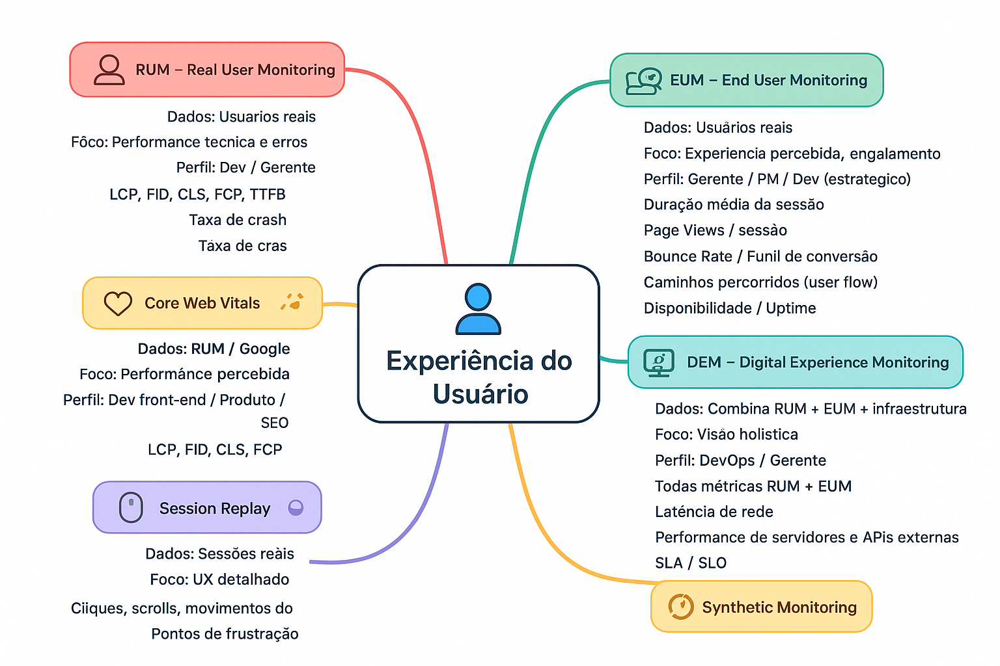

# 🧠 Mapa Mental de Monitoramento de Experiência do Usuário

## Tipos Principais

### 1. RUM (Real User Monitoring)
- **Dados:** Usuários reais
- **Foco:** Performance técnica e erros
- **Perfil recomendado:** Dev / Gerente
- **Métricas típicas:**
  - LCP (Largest Contentful Paint)
  - FID (First Input Delay)
  - CLS (Cumulative Layout Shift)
  - FCP (First Contentful Paint)
  - TTFB (Time To First Byte)
  - Taxa de erros JS
  - Taxa de crash

### 2. EUM (End User Monitoring)
- **Dados:** Usuários reais
- **Foco:** Experiência percebida, engajamento
- **Perfil recomendado:** Gerente / Dev (insights estratégicos)
- **Métricas típicas:**
  - Duração média da sessão
  - Page Views / sessão
  - Bounce Rate / abandono
  - Funil de conversão
  - Caminhos percorridos (user flow)
  - Disponibilidade / Uptime

### 3. DEM (Digital Experience Monitoring)
- **Dados:** Múltiplas fontes (RUM + EUM + infraestrutura)
- **Foco:** Visão holística da experiência digital
- **Perfil recomendado:** DevOps / Gerente
- **Métricas típicas:**
  - Todas métricas RUM + EUM
  - Latência de rede
  - Performance de servidores e APIs externas
  - SLA / SLO

### 4. Synthetic Monitoring
- **Dados:** Fluxos simulados
- **Foco:** Disponibilidade e performance preventiva
- **Perfil recomendado:** Dev / Ops
- **Métricas típicas:**
  - Tempo de resposta de páginas e APIs
  - Disponibilidade de endpoints
  - Alertas de erro

### 5. Session Replay
- **Dados:** Sessões reais
- **Foco:** UX detalhado
- **Perfil recomendado:** UX / Dev
- **Métricas típicas:**
  - Cliques, scrolls, movimentos do mouse
  - Identificação de pontos de frustração

### 6. Core Web Vitals
- **Dados:** RUM / Google
- **Foco:** Performance percebida
- **Perfil recomendado:** Dev front-end / Produto / SEO
- **Métricas típicas:**
  - LCP, FID, CLS, FCP

---

## Exemplo Visual: UX Map

---
